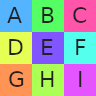
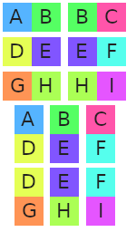
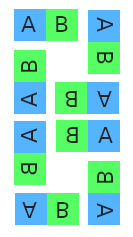

Specifing the Adjacency Model Directly
===

The simplest way to configure the adjacency model is to provide it with a sample as input.

#### [Library Example](#tab/lib)

```csharp
var model = new AdjacentModel();
ITopoArray<Tile> sample = ...;
model.AddSample(sample);
```

#### [Config Example](#tab/config)

```javascript
{
    "model": {"type": "adjacent"},
    "src": "my_sample.png",
    ...
}
```

----

The model then analyses the sample for **adjacency pairs**.

For example, if we had a sample of 3x3 tiles like the following

<figure>

</figure>

Then it would extract the following pairs.

<figure>

</figure>

The sample has given 6 left-right pairs, and 6 up-down pairs (if this was a 3d example, there could also be pairs along the z-axis).

These pairs are then used when generating the result - thanks to the model, it knows that tile A can be placed left of tile B, and so on.

Sometimes, it's not convienient to specify the pairs by giving a sample image:

 * There might be too many combinations to represent in one image.
 * (console app only) some tile formats do not let you specify a sample at all

In these cases, you can specify all the adjacency pairs directly. It requires some care though - you need to define a lot of pairs before there are enough legal placements that WFC can find a result.

## Adding a single pair

To add a pair, you need to specify the two tiles, and the axis on which they can be placed next to each other. This example allows the model to place tile 2 to the right of tile 1, and similarly to place tile 1 to the left of tile 2.

#### [Library Example](#tab/lib)

```csharp
var model = new AdjacentModel();
var tile1 = new Tile(1);
var tile2 = new Tile(2);
model.AddAdjacency(tile1, tile2, 1, 0, 0);
```

#### [Config Example](#tab/config)

```javascript
{
    ...
    "adjacencies": [
        {"left": [1], "right": [2]}
    ]
}
```

The format used in javascript is described in more detail [here](config_files.md#adjacency-config).

----

## Adding pairs combinatorially

It's often the case that tiles can be grouped together, and any tile in one group can be placed next to any tile in another group. This is particularly common with [Wang tiles](https://en.wikipedia.org/wiki/Wang_tile), where the adjacent tiles are *entirely* determined by the border of the tile.

The following example shows how to connect two groups. Tiles 1 and 2 can be placed above tiles 3 and 4. It is equivalent to adding 4 adjacent pairs between single tiles, 1 and 3, 1 and 4, 2 and 3, 2 and 4.

#### [Library Example](#tab/lib)

```csharp
var model = new AdjacentModel();
var tile1 = new Tile(1);
var tile2 = new Tile(2);
var tile3 = new Tile(3);
var tile4 = new Tile(4);
model.AddAdjacency(new []{tile1, tile2}, new []{tile3, tile4}, 0, 1, 0);
```

#### [Config Example](#tab/config)

```javascript
{
    ...
    "adjacencies": [
        {"up": [1, 2], "down": [3, 4]}
    ]
}
```

----


 ## Pairs and rotations

 So far, we've just been adding adjacency pairs along a single axis. But if you have configured [tiles with rotation](rotation.md), then often there are rotated versions of an adjacenty pair that go together.

 For example, if you allowed all rotations and reflections of tiles, then you'd likely want all 8 pairs below to be legal placements.

<figure>

</figure>

DeBroglie can automatically generate these rotations for you. It uses the same configuration as used elsewhere for rotations.


#### [Library Example](#tab/lib)

```csharp
var model = new AdjacentModel();
var rotations = tileRotationBuilder.Build();
var tile1 = new Tile(1);
var tile2 = new Tile(2);
model.AddAdjacency(new []{tile1}, new []{tile2}, 0, 1, 0, rotations);
```

#### [Config Example](#tab/config)

```javascript
{
    ...
    "adjacencies": [
        {"left": [1], "down": [2]}
    ],
    "rotationalSymmetry": 4,
    "reflectionalSymmetry": true
}
```

In the console app, any rotation configuration is automatically applied to `adjacencies`.

----

Auto Adjacency
==============
DeBroglie Console has a mode that can automatically detect tiles that can be placed adjacent to each other. This feature is only supported for file formats that have color pixel data for each tile. Currently, that means only a set of bitmaps, or set of MagicaVoxel files.

To determine automatically if two tiles can be adjacent to each other, DeBroglie extracts the strip of pixels on the sides of the tiles that will abut, and then compares
the pixels to see if they match. If their similarity is closer than than configured tolerance, then an adjacency is added to the model. Tolerance varies from 0, meaning an
exact match, to 1, meaning any two tiles are accepted.