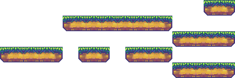
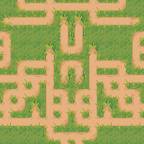

# Constraints

Constraints are a way to make additional hard requirements about the generated output.
Unlike models, constraints can be *non-local*, meaning they force some property of the entire output,
not just within a small rectangles.

You can have as many constraints as you like during generation, however with multiple constraints it 
can be hard for the WFC to find a valid solution. Turning on backtracking can aleviate this.

Each constraint is for enforcing a different effect. The available constraints are discussed below.

## Border

<xref:DeBroglie.Constraints.BorderConstraint> class restricts what tiles can be selected in various regions of the output. It's pretty common that you want to specify the borders as being ground, or empty, or whatever, as otherwise if DeBroglie will often generate structures that lead off the edge and are clipped.

> [!NOTE]
> <xref:DeBroglie.Constraints.BorderConstraint> only affects the initial set of tiles that can be legally placed. That means it is not doing anything except calling [Ban](xref:DeBroglie.TilePropagator.Ban(System.Int32,System.Int32,System.Int32,DeBroglie.Tile)) and [Select](xref:DeBroglie.TilePropagator.Select(System.Int32,System.Int32,System.Int32,DeBroglie.Tile)) on startup, which you can also do manually. <xref:DeBroglie.Constraints.BorderConstraint> is just a convenience.

BorderConstraing specifies a set of cells using a simple logic. First, an inclusion set of cells is defined by the <xref:DeBroglie.Constraints.BorderConstraint.Sides> field. This field is a bit field of flags, where there is one flag for each of the boundary sides of the output area (4 in 2d, 6 in 3d). An exclusion set is defined similarly from the  <xref:DeBroglie.Constraints.BorderConstraint.ExcludeSides> field. To get the set of locations affected, subtract the exclusion set from the inclusion set, then optionally invert if <xref:DeBroglie.Constraints.BorderConstraint.InvertArea> is set.

For each affected location, BorderConstratin calls [Select](xref:DeBroglie.TilePropagator.Select(System.Int32,System.Int32,System.Int32,DeBroglie.Tile)) with the Tile specified. If the <xref:DeBroglie.Constraints.BorderConstraint.Ban> field is set, then it calls [Ban](xref:DeBroglie.TilePropagator.Ban(System.Int32,System.Int32,System.Int32,DeBroglie.Tile)) instead of [Select](xref:DeBroglie.TilePropagator.Select(System.Int32,System.Int32,System.Int32,DeBroglie.Tile)).

**Example**

<figure>

<figcaption>Using a border constraint ensures that none of the blue leaves the edge, forcing loops.</figcaption>
</figure>

## Path Constraints

Path constraints are a collection of related constraints described <a href="path_constraints.md">on a separate page</a>.

## Fixed Tile

The <xref:DeBroglie.Constraints.FixedTileConstraint> class forces a given location to be the specified Tile at initialization. If you don't specify a location, a random legal location is chosen.

You can use <xref:DeBroglie.Constraints.FixedTileConstraint> to force certain features to always be generated.

**Example**

<figure>
<a href="https://github.com/BorisTheBrave/DeBroglie/blob/master/samples/castle/castle.json">
<video autoplay loop muted>
  <source src="../images/castle_fixed.webm" type="video/webm">
</video>
</a>
<figcaption>Several castles all generated with a fixed turret location</figcaption>
</figure>

## Max Consecutive

The <xref:DeBroglie.Constraints.MaxConsecutiveConstraint> class prevents more than a certain number of tiles appearing consecutively along the x, y or z axis.

<figure>
<table>
<tr>
<td>
MaxCount
</td>
<td></td>
</tr>
<tr>
<td>2</td>
<td>

</td>
</tr>
<tr>
<td>3</td>
<td>

</td>
</tr>
<tr>
<td>10</td>
<td>

</td>
</tr>
<figcaption>Platforms generated with the MaxConsecutive constraint with different values of MaxCount.</figcaption>
</figure>

## Mirror

The <xref:DeBroglie.Constraints.MirrorXConstraint> and <xref:DeBroglie.Constraints.MirrorYConstraint> class forces the generated output to be symetric about the x-axis / y-axis.

**Example**

<figure>

</figure>

## Symmetry

The <xref:DeBroglie.Constraints.SymmetryConstraint> constraint is a abstract generalized version of the mirror constraint. It can be used for more complicated symmetries of the generated output.

## Count

The <xref:DeBroglie.Constraints.CountConstraint> class forces the number of a given tile or set of tiles to be at most or at least a given number.

## Separation

The <xref:DeBroglie.Constraints.SeparationConstraint> class forces particular tiles to not be placed near each other.

It's useful for giving a more even distribution of tiles, similar to a Poisson disk sampling.

## Custom Constraints

You can define your own constraints by extending <xref:DeBroglie.Constraints.ITileConstraint>. The Init method is called once per propagator run, and the Check method is called after each step, each time tiles are selected. 

Inside these methods, you can call [Select](xref:DeBroglie.TilePropagator.Select(System.Int32,System.Int32,System.Int32,DeBroglie.Tile)) and [Ban](xref:DeBroglie.TilePropagator.Ban(System.Int32,System.Int32,System.Int32,DeBroglie.Tile)) to control what tiles can be legally placed. You can also call <xref:DeBroglie.TilePropagator.SetContradiction> to indicate that something is wrong and generation cannot continue. This will cause the propagator to give up, or backtrack, according to settings.
