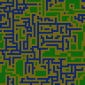
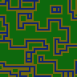
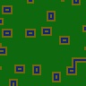
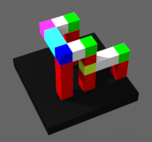
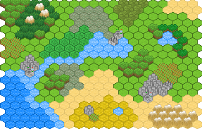

Key Concepts
============

**2d/3d** - DeBroglie works for both 2d and 3d generation, by selecting an appropriate <xref:DeBroglie.Topo.Topology>. Generally, most APIs accept `(x,y,z)` co-ordinates - the `z` value should just be 0 if you are working in 2d.

**<xref:DeBroglie.Tile>** - The individual units the generation algorithm works with. Tiles wrap a value of any type, but they are usually an integer index into a tileset, or a @System.Drawing.Color when working with bitmaps. The value isn't important, all relevant information about a tile is stored externally.

**<xref:DeBroglie.Topo.Topology>** - Specifies an area or volume of [space](https://en.wikipedia.org/wiki/Discrete_space) and how to navigate it. There's more detail in the [topology section](#topology).

**<xref:DeBroglie.Topo.ITopoArray`1>** - A 2d or 3d read-only array with one entry per space in the corresponding @DeBroglie.Topo.Topology. They are used as both the input and output format for the library. You can construct these with methods on @DeBroglie.Topo.TopoArray. ITopoArray objects can also have a mask associated with them, indicating missing values.

**[Model](xref:DeBroglie.Models.TileModel)** - A model specifies constraints between nearby tiles in the generated output. See [models](#models) for more info.

**[Propagator](xref:DeBroglie.TilePropagator)** - A propogator is responsible for generating an output that satifies the constraints specified by the [model](xref:DeBroglie.Models.TileModel) and other [constraints](xref:DeBroglie.Constraints.ITileConstraint).

Features
========

Models
------
Models are the key way to control the generation process in DeBroglie. They specify what combinations of tiles are legal to place near each other.

Models have only have a few parameters - most information is inferred by giving them samples tilemaps.

### Adjacent

<xref:DeBroglie.Models.AdjacentModel> constrains which tiles can be placed adjacent to which other ones. It does so by maintaining for each tile, 
a list of tiles that can be placed next to it in each direction. The list is always symmetric, i.e. if it is legal to place tile B directly above tile A, 
then it is legal to place A directly below B.

Adding a sample to an adjacent model adds all adjacent tile pairs in the sample into the legal adjacency lists. 

The adjacenct model is very "loose" - it doesn't constrain the choice of tiles as much as the overlapping model. This makes it a good choice
when the relationship between tiles is very complex, or you are adding a lot other [constraints](#constraints) directly.

**Example**

<figure>

<figcaption><a href="xref:DeBroglie.Models.AdjacentModel">AdjacentModel</a> can see that blue and green are never adjacent, but otherwise doesn't resemble the sample closely</figcaption>
</figure>

### Overlapping

<xref:DeBroglie.Models.OverlappingModel> constrains that every `n` by `n` rectangle in the output is a copy of a rectangle taken from the sample (potentially with rotation / reflection).

The model has three parametrs, `nx`, `ny` and `nz` which specify the dimensions of the rectangle/cuboid in the output. For convenience, you can just specify a value for `n` that sets all three. Typically `n` is only 2 or 3 - any larger and the algorithm can run quite slow and becomes increasingly unlikely to find a result.

Compared to the adjacent model, the overlapping model is quite strict. This means it typically needs a larger amount of sample input to get good results, but when it does work, it can accurately reproduce many features of the samples that the adjacent model will simply scramble.

In particular, the overlapping model can detect corners, lines and junctions. In conjunction with the propogation by the Wave Function Collapse algorithm, this means that rooms and pathways will get detected and output, but with variations on the placement, size and direction.

**Example**

<figure>

<figcaption><a href="xref:DeBroglie.Models.OverlappingModel">OverlappingModel</a> with <tt>n</tt> = 2</figcaption>
</figure>

<figure>

<figcaption><a href="xref:DeBroglie.Models.OverlappingModel">OverlappingModel</a> with <tt>n</tt> = 3</figcaption>
</figure>

### Other model functionaltiy

As mentioned, models also track the frequency of tiles in the sample image. You can make changes to this by calling [MultiplyFrequency](xref:DeBroglie.Models.TileModel.MultiplyFrequency(DeBroglie.Tile,System.Double)).

<figure>

<figcaption>Same example as overlapping model with frequency of green boosted.</figcaption>
</figure>

<figure>

<figcaption>Same example as overlapping model with frequency of green reduced.</figcaption>
</figure>

Constraints
-----------

Constraints are a way to make additional hard requirements about the generated output.
Unlike models, constraints can be *non-local*, meaning they force some property of the entire image,
not just within a small rectangles. 

### Border

<xref:DeBroglie.Constraints.BorderConstraint> class restricts what tiles can be selected in various regions of the output. It's pretty common that you want to specify the borders as being ground, or empty, or whatever, as otherwise if DeBroglie will often generate structures that lead off the edge and are clipped.

> [!NOTE]
> <xref:DeBroglie.Constraints.BorderConstraint> only affects the initial set of tiles that can be legally placed. That means it is not doing anything except calling [Ban](xref:DeBroglie.TilePropagator.Ban(System.Int32,System.Int32,System.Int32,DeBroglie.Tile)) and [Select](xref:DeBroglie.TilePropagator.Select(System.Int32,System.Int32,System.Int32,DeBroglie.Tile)) on startup, which you can also do manually. <xref:DeBroglie.Constraints.BorderConstraint> is just a convenience.

BorderConstraing specifies a set of cells using a simple logic. First, an inclusion set of cells is defined by the <xref:DeBroglie.Constraints.BorderConstraint.Sides> field. This field is a bit field of flags, where there is one flag for each of the boundary sides of the output area (4 in 2d, 6 in 3d). An exclusion set is defined similarly from the  <xref:DeBroglie.Constraints.BorderConstraint.ExcludeSides> field. To get the set of locations affected, subtract the exclusion set from the inclusion set, then optionally invert if <xref:DeBroglie.Constraints.BorderConstraint.InvertArea> is set.

For each affected location, BorderConstratin calls [Select](xref:DeBroglie.TilePropagator.Select(System.Int32,System.Int32,System.Int32,DeBroglie.Tile)) with the Tile specified. If the <xref:DeBroglie.Constraints.BorderConstraint.Ban> field is set, then it calls [Ban](xref:DeBroglie.TilePropagator.Ban(System.Int32,System.Int32,System.Int32,DeBroglie.Tile)) isntead of [Select](xref:DeBroglie.TilePropagator.Select(System.Int32,System.Int32,System.Int32,DeBroglie.Tile)).

**Example**

<figure>

<figcaption>Using a border constraint ensures that none of the blue leaves the edge, forcing loops.</figcaption>
</figure>

### Path

The <xref:DeBroglie.Constraints.PathConstraint> checks that it is possible to connect several locations together via a continuous path of adjacent tiles. It does this by banning any tile placement that would make such a path impossible.

Set <xref:DeBroglie.Constraints.PathConstraint.PathTiles> to the set of tiles that are considered on the path. Any two adjacent locations with tiles in this set are connected, and if x is connected to y and y is connected to z, then x and z are also connected.

By default, <xref:DeBroglie.Constraints.PathConstraint> forces all path tiles to be connect to each others. However, if you set <xref:DeBroglie.Constraints.PathConstraint.EndPoints> then instead it forces that those specific points connect to each other, but doesn't stop extra path tiles being placed.

> [!WARNING]
> <xref:DeBroglie.Constraints.PathConstraint> does not have a great deal of lookahead, so adding it will significantly increase the amount of retries needed to get a successful generation. You may need to enable [backtracking](#backtracking) to get a successful result.

**Example**

<figure>

<figcaption>Using a path constraint ensures you can trace a path from any blue pixel to any other one.</figcaption>
</figure>

### Custom Constraints

You can define your own constraints by extending <xref:DeBroglie.Constraints.ITileConstraint>. The Init method is called once per propagator run, and the Check method is called after each step, each time tiles are selected. 

Inside these methods, you can call [Select](xref:DeBroglie.TilePropagator.Select(System.Int32,System.Int32,System.Int32,DeBroglie.Tile)) and [Ban](xref:DeBroglie.TilePropagator.Ban(System.Int32,System.Int32,System.Int32,DeBroglie.Tile)) to control what tiles can be legally placed. You can also return <xref:DeBroglie.Resolution.Contradiction> to indicate that something is wrong and generation cannot continue. Otherwise, return <xref:DeBroglie.Resolution.Undecided> to indicate that generation should continue.

Backtracking
------------

By default when you call <xref:DeBroglie.TilePropagator.Run> the WCF algorithm keeps adding tiles until it has filled every location, or until it is impossible to place a tile that satisfies all the constraints set up. It then returns <xref:DeBroglie.Resolution.Contradiction>.

If you set the backtrack argument to `true` when constructing the <xref:DeBroglie.TilePropagator>, instead, when a contradiction occurs it does not give up. Instead it rolls back the most recent tile placement, and tries another placment instead. [In this manner](https://en.wikipedia.org/wiki/Backtracking), it can explore the entire space of possible tile placements, seeking one that satifies the constraints. <xref:DeBroglie.Resolution.Contradiction> is only returned if all possibilities have been exhausted.

Backtracking is very powerful and general, and can solve extremely difficult layouts. However, it can be quite slow, and consumes a great deal of memory, so it is generally only appropriate for generating small arrays.

Topology
--------

The most common case of using DeBroglie is to generate 2d images and tile maps, however, that is not all that can be generated.

<figure>

<figcaption>Example of 3d generation. Rendered with <a href="http://magicavoxel.net">MagicaVoxel</a></figcaption>
</figure>

<figure>

<figcaption>Example of hex generation. Rendered with <a href="https://www.mapeditor.org">Tiled</a></figcaption>
</figure>

DeBroglie uses a mechanism called <xref:DeBroglie.Topo.Topology> to specify the type of area or volume to generate, what size it is, and whether it should wrap around at the edges (i.e. is it *periodic*). Topologies do not actually store data, they just specify the dimensions. Actual data is stored in an <xref:DeBroglie.Topo.ITopoArray`1>.

Currently, three types of topology are supported: 2d square grid, 2d hex grid, and 3d cube grid. 

The topology of the generated result is inferred from the input samples. When using the command line tool the topology of the input is based on the file being read. But as a C# library, samples are passed as <xref:DeBroglie.Topo.ITopoArray`1> objects.

So you must directly call the <xref:DeBroglie.Topo.Topology> constructor, and then create <xref:DeBroglie.Topo.ITopoArray`1> objects using the methods on <xref:DeBroglie.Topo.TopoArray>.  There's also many shortcut methods that don't require a topology if you just want to work with square grids.

### Hexagonal Topology

Hexagonal topologies use a convention of "pointy side up". The x-axis moves to the right, and the y-axis moves down and to the left. This means the library generates rhombus shaped output. Additionally, periodic input / output is not supported.

Using the [Tiled format](https://www.mapeditor.org/) for import/export of hexagonal tilemaps is recommended, as most software doesn't have support for hexagons. DeBroglie comes with <xref:DeBroglie.TiledUtil> to facilitate converting between <xref:DeBroglie.Topo.ITopoArray`1> objects and Tiled maps.

Rotation
--------

Handling rotation of the input sample is a complex topic, and is discussed [in a separate article](xref:rotation_article).