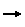
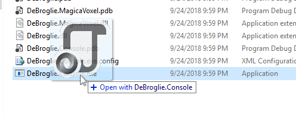
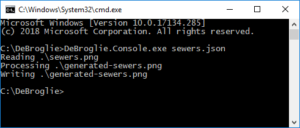

Introduction
=====================================

DeBroglie is a C# library implementing the [Wave Function Collapse](https://github.com/mxgmn/WaveFunctionCollapse) algorithm with support for additional non-local constraints, and other useful features.

Wave Function Collapse (WFC) is an constraint-based algorithm for which takes a small input image or tilemap
and procedurally generating a larger image in the same style, such as:

<figure>
<a href="https://github.com/BorisTheBrave/DeBroglie/blob/master/samples/mxgmn/city.json">



</a>
</figure>
 
DeBroglie is stocked with loads of features to help customize the generation process.

<b>[See the gallery for some visual examples of what DeBroglie can do](gallery.md)</b>.

Feature Overview
--------

* ["Overlapped"](features.md#overlapping) model implementation of WFC
* [Non-local constraints](features.md#constraints) allow you to specify other desired properties of the result
* [Backtracking](features.md#backtracking) support - some WFC implementations immediately give up when a contradiction occurs.
* [supports 2d tiles, hex grids, and 3d voxels](features.md#topology) 

What is WFC?
------------

Wave Function Collapse is a constraint based algorithm that generates bitmaps, tilemaps etc one tile at a time, based off a sample image.

<video src="../images/pathway.webm" autoplay loop></video>

The original author of WFC has an excellent [explanation of the core algorithm](https://github.com/mxgmn/WaveFunctionCollapse)

DeBroglie uses the core idea mostly unchanged, though enhanced in various ways explained in [Features](features.md).

Usage
---------------

To use DeBroglie, select one of the [models](features.md#models) that controls the generation process. 

You then give the model a sample array want to generalize. Or you can [specify a model directly](adjacency.md).

There's lot of [features](features.md) that can be applied at this point.

The last detail needed is the size of the output image desired.

Then you run a propagator that will generate the output one tile at a time. 
Depending on the difficulty of the generation, the process can fail and require restarting.

Quick Start (C#)
=================

The DeBroglie library can be downloaded via [NuGet](https://www.nuget.org/packages/DeBroglie). 
Or it can easily be built [from source](https://github.com/BorisTheBrave/DeBroglie).

Once you are referencing the library. here's a simple snippet that demonstrates constructing the relevant objects and running them.

```csharp
// Define some sample data
ITopoArray<char> sample = TopoArray.Create(new[]
{
    new[]{ '_', '_', '_'},
    new[]{ '_', '*', '_'},
    new[]{ '_', '_', '_'},
}, periodic: false);
// Specify the model used for generation
var model = new AdjacentModel(sample.ToTiles());
// Set the output dimensions
var topology = new Topology(10, 10, periodic: false);
// Acturally run the algorithm
var propagator = new TilePropagator(model, topology);
var status = propagator.Run();
if (status != Resolution.Decided) throw new Exception("Undecided");
var output = propagator.ToValueArray<char>();
// Display the results
for (var y = 0; y < 10; y++)
{
    for (var x = 0; x < 10; x++)
    {
        System.Console.Write(output.Get(x, y));
    }
    System.Console.WriteLine();
}
```

Quick Start (Command Line)
==========================

Download the command line application from [Releases](https://github.com/BorisTheBrave/DeBroglie/releases). 
The commandline app is available on Windows/Linux/MacOS, but this guide assume you are on windows.

Then download this sample file: <a href="../images/sewers.png">sewers.png</a>

Then, create a json file, `sewers.json` with the following content. Save it in the same directory as sewers.png.

```json
{
    "src": "sewers.png",
    "dest": "generated-sewers.png",
    "model": {
        "type": "overlapping",
        "n": 3
    },
    "periodicInput": true,
    "periodic": true,
    "symmetry": 8
}
```

Now run DeBroglie.Console.exe with the json file. To do so, drag the file onto the executable. 



Or you can run something like the following in the command line.

```
path_to_debroglie/DeBroglie.Console.exe path_to_json/sewers.json
```



Either way, it should create a new image called `generated-sewers.png`.

Read about the [JSON file format](config_files.md) for details of what you can do with the JSON file, 
or browse the <a href="https://github.com/BorisTheBrave/DeBroglie/tree/master/samples">samples</a> for inspiration.