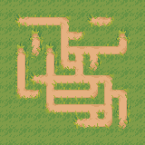
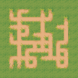

# Path Constraints

DeBroglie comes with a set of <a href="constraints.md">constraints</a> called **path constraints**. These constraints all work similarly, and all concern the connectivy across a range of tiles.

A "path" is a route from one cell to another, stepping one adjacency at a time. Each path constraint takes ana [IPathSpec](xref:Constraints.IPathSpec) as input, which specifies what paths are considered valid. The IPathSpec also lets you control which tiles are "relevant", which is discussed later.

There are currently three constraints:

* [ConnectedConstraint](xref:DeBroglie.Constraints.ConnectedConstraint) - ensures that there is a valid path between relevant tiles.
* [LoopConstraint](xref:DeBroglie.Constraints.LoopConstraint) - ensures there are at least two independent paths between relevant tiles.
* [AcyclicConstraint](xref:DeBroglie.Constrains.AcyclicConstraint) - ensures there are are no loops at all in the generated result.

> [!WARNING]
> Note that path constraints are generally more performance heavy than other constraints, and usually require [backtracking](features.md#backtracking) to get good results.

**Example**

<figure>

<figcaption>Before and adding a ConnectedConstraint with an EdgedPathSpec</figcaption>
</figure>

## Path Specs

Path specs describe what paths are considered valid, and what is considered relevant. There are two implementations, [PathSpec](xref:DeBroglie.Constraints.PathSpec) and [EdgedPathSpec](xref:DeBroglie.Constraints.EdgedPathSpec). The latter is slower, but more flexible, however they both work similarly.

PathSpec just has a list of tiles that form the path tiles. As long as these tiles are placed adjacency, a valid path can route through them. EdgedPathSpec, on the other hand, lists a set of tiles and what "exits" it has. A path can only route through a pair of adjacent tiles if they both have exits pointing to each other.

EdgedPathSpec is useful for tiles that literally have a picture of a path on them. For example consider placing the tiles  and  together. Both tiles have a picture of a path on them, but the path exits the tiles only on certain edges.  means they are connected, but  is not. 

## Connected Constraint

The <xref:DeBroglie.Constraints.Connected> checks that for any given two relevant cells, it is possible to connect them together via a path of adjacent path tiles. It does this by banning any tile placement that would make such a path impossible.

**Example**

<figure>

<figcaption>Using a path constraint ensures you can trace a path from any blue pixel to any other one.</figcaption>
</figure>

## Loop Constraint

The loop constraint backtracks whenevever a chokepoint is found in the set of available paths, effectively forcing there to be at least two non-overlapping valid paths between any two relevant tiles.

## Acyclic Constraint

The acyclic constraint backtracks whenever a cycle is found, forcing the remaining paths into a [tree](https://en.wikipedia.org/wiki/Tree_(graph_theory)) or [forest](https://en.wikipedia.org/wiki/Tree_(graph_theory)#Forest). The acyclic constraint ignores relevancy for now.