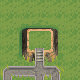
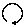
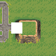
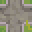
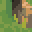
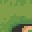
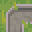
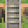

# Rotation

> [!Warning]
> Although this feature of DeBroglie works, I consider it to be a failure.
> It is very complicated to understand, for relatively little benefit. It is an entirely *optional* function of DeBroglie - you can achieve similar results
> by creating your own rotated tiles, and many users have reported they've found that easier than the built in solution.

While the core WFC algorithm DeBroglie uses is agnostic to rotation and reflections, many tiles sets and designs have some amount of symmetry. DeBroglie lets you specify what symmetry to use. This has several advantages:

1) **You need smaller input** - DeBroglie can take your samples, and create rotated and reflected copies, greatly expanding the amount of data to work with.
2) **You need smaller configuration** - most methods come with a rotation aware overload, which will repeat the operation for other rortations and reflections
3) **You need fewer tiles** - DeBroglie can generate additional tiles that are rotated and reflected copies of existing tiles.
4) **You can avoid bias** - by enforcing symmetry, you cannot accidentally introduce patterns that only work at a given orientation.

Overall, it means a small amount of input can specify a lot of output variety:

<figure>
<a href="https://github.com/BorisTheBrave/DeBroglie/blob/master/samples/grass/map.json">


</a>
<figcaption>See how the output contains rotated parts of the input image. (<a href="../images/rotation.webm">animated</a>)</figcaption>
</figure>

> [!Note]
> Rotations and reflections are part of the same system in DeBroglie. For brevity, both rotations and reflections are called rotations in code and documentation, and they share the [Rotation class](xref:DeBroglie.Rot.Rotation)

> [!Note]
> Rotations are entirely a pre-processing step for convenience. It's always possible to achieve the same effects manually with more reptitions.

To work with rotations, you need construct a <xref:DeBroglie.Rot.TileRotation> object that contains rotation configuration. You can use a <xref:DeBroglie.Rot.TileRotationBuilder> for this. Many DeBroglie methods have an overload that takes a <xref:DeBroglie.Rot.TileRotation>, this indicates they are rotation aware. Usually this means that the method body will be repeated for each configured rotation.


Quick Start
-----------

There are three common use cases in DeBroglie.

### Single pixels / voxels

If your "tiles" are single pixels, or single voxels, then you just need to set the desired symmetry by passing in `rotationalSymmetry` and `reflectionalSymmetry` (as described [below](#specifying-symmetry)). No further configuration is needed.

#### [Library Example](#tab/lib)

```csharp
// Specifies we're using all 8 rotations and reflections
var rotations = new TileRotation(4, true);
// Add a new sample to the model, using 8 copies
model.AddSample(sample, rotations)
```

#### [Config Example](#tab/config)

```javascript
{
    "src": "sample...",
    "rotationalSymmetry": 4,
    "reflectionalSymmetry": true,
}
```

***

### Complete tilesets

If your tileset comes extra tiles for all rotations, e.g.


Then you need to specify how the tiles relate to each other. If you specify one reflection
and one rotation for each tile, then DeBroglie can infer all other rotations and reflections.

#### [Library Example](#tab/lib)

```csharp
var builder = new TileRotationBuilder(4, true);
// tile 1 rotates clockwise to give tile 2
builder.Add(tile1, new Rotation(90), tile2); 
// tile 1 reflects in x-axis to give itself.
builder.Add(tile1, new Rotation(0, true), tile1);
var rotations = builder.Build();
...
// Add a new sample to the model, using all
// eight rotations and reflections, replacing
// tiles as specified above
model.AddSample(sample, rotations)
```

#### [Config Example](#tab/config)

```javascript
{
    ...
    "rotationalSymmetry": 4,
    "reflectionalSymmetry": true,
    "tiles": [
        // tile 1 rotates clockwise to give tile 2
        // tile 1 reflects in x-axis to give itself.
        {"value": 1, "rotateCw": 2, "reflectX": 1}
    ]
}
```

***

### Incomplete tilesets

Some tileset only comes with fewer tiles, and expects you make more tiles via rotation:


In this case, you can use DeBroglie to generate the extra tiles for you. You specify relations between tiles as in the complete tileset case,
but new tiles are created for anything left unspecified.

#### [Library Example](#tab/lib)

```csharp
var builder = new TileRotationBuilder(4, true, TileRotationTreatment.Generated);
// tile 1 reflects in x-axis to give itself.
builder.Add(tile1, new Rotation(0, true), tile1);
// We haven't added a rotation, so a new rotation tile will
// be created when DeBroglie tries to rotate tile 1.

// You can also specify self-symmetries like so
//builder.AddSymmetry(tile1, TileSymmetry.T);

var rotations = builder.Build();
...
// Add a new sample to the model, using all
// eight rotations and reflections, generating new tiles as needed
model.AddSample(sample,  rotations)
```

#### [Config Example](#tab/config)

```javascript
{
    ...
    "rotationTreatment": "generated",

    "rotationalSymmetry": 4,
    "reflectionalSymmetry": true,
    "tiles": [
        // tile 1 reflects in x-axis to give itself.
        {"value": 1, "reflectX": 1}
        // We haven't added a rotation, so a new rotation tile will
        // be created when DeBroglie tries to rotate tile 1.

        // You can also specify self-symmetries like so
        //{"value": 1, "tileSymmetry": "T"}
    ]
}
```

***


Specifying Symmetry
-------------------
In order to use rotations, you must specify what [symmetry group](https://en.wikipedia.org/wiki/Symmetry_group) you are using. This determines the list of rotations which are used for making copies of input samples and for other things.

There are two parameters: `rotationalSymmetry` and `reflectionalSymmetry`. The following table table how different choices effect what set of rotations are used.

| Rotational<br/>Symmetry | Reflectional<br/>Symmetry | All Rotations |
|----------------------|----------------------|----------|
| 1 | false |   &nbsp;&nbsp;&nbsp; (default) |
| 2 | false |    |
| 4 | false |      |
| 1 | true |    |
| 2 | true |      |
| 4 | true |          |

It works similarly for hexagonal grids, except `rotationalSymmetry` can take values 1, 2, 3 or 6.

Rotation can be used in 3d, but it only effects the x-y plane.

#### [Library Example](#tab/lib)

```csharp
var rotations = new TileRotation(4, true);
```

#### [Config Example](#tab/config)

```javascript
{
    "rotationalSymmetry": 4,
    "reflectionalSymmetry": true,
}
```

***

Specifying Tile Rotations
-------------------------

The symmetry specified above is the most fundamental configuration for rotations. If you are rotating a pixel or voxel array, it's likely all you need.

In other cases, it can be insufficient.

DeBroglie works on tiles, and you cannot just naively rotate the sample array but otherwise leave the tiles unchanged. The tiles will stop joining up with each other:

<canvas id="myCanvas" width="300" height="300"></canvas>
<script src="animation.js"></script>

So when rotating a sample, it's necessary to rotate the tiles as well, and that requires extra information to be passed to DeBroglie.

Starting with a given tile, and for a given rotation / reflection, there are 4 choices for what we might want to do:

 1) Re-use the same tile **unchanged**. This is typically the case when the tile is symmetric.
 2) **Replace** the tile with another tile. This is what you want when a tileset comes with rotated variants of the tile in question.
 3) **Generate** a rotated variant of the tile by rotating the actual bitmap / voxels that make up the tile. This is what you want when you don't already have a rotated copy, and it makes sense to rotate the inner details.
 4) **Fail** to rotate. This leaves a hole in the rotated sample, and is typically used when it only makes sense to display a tile a certain way around.
 
 For example, suppose we wanted to rotate the following sample clockwise:

 
 
 

The we had to treat the different tiles in different ways.

The crossroad tile  is **unchanged** as it is fully symmetric.

The bottom left cliff corner  gets **replaced** with the top left corner . These two images don't look similar due to the change in perspective, but you can easily see that a curve in the cliff would change as you rotate the view by 90 degrees.

The path tiles have no perspective in them, so we are free to take a path tile  and **generate** a rotation from it  by simply rotating the image.

The steps  cannot be generated due to perspective and the tileset doesn't have an appropriate replacement, so it **fails** and just leaves a hole in the rotated sample. Holes are ok, though! We're just using the rotated sample as more input examples for the selected model, and the model will know to ignore holes.

The default treatment of a tile is Unchanged. If we want anything else, we must specify it using a <xref:DeBroglie.Rot.TileRotationBuilder> (or in [tile data](config_files.md#tile-data-config), when using JSON configuration).

### Tile Symmetries

<xref:DeBroglie.Rot.TileSymmetry> is a quick way of saying that a tile is unaffected by some reflections or rotations. The more symmetric a tile is, the fewer rotations of a tile are needed, as DeBroglie can re-use the tile itself.

Tile symmetries are set by calling <xref:DeBroglie.Rot.TileRotationBuilder.AddSymmetry(DeBroglie.Tile,DeBroglie.Rot.TileSymmetry)>

The following table shows the possible tile symmetries. Each is named after a letter which is similarly symmetric. 

| Letter| Description|
|-------|-------------|
|`F` or `none`| No symmetry. |
|`X` or `full` | Fully symmetric. |
|`T`| Reflectable on y-axis. |
|`I`| Reflectable on x-axis and y-axis. |
|`L`| Reflectable on one diagonal. |
|`\`| Reflectable on both diagonals.|
|`Q`| Reflectable on other diagonal. |
|`E`| Reflectable on x-axis. |
|`N`| Can rotate 180 degrees. |
|`cyclic`| Any rotation, but no reflection. |


> [!Warning]
> Tile symmetry is only available for square grids. Use [Tile Replacements](#tile-replacements) to get the same effect on hex grids.


### Tile Replacements

The most flexible way to configure rotations in DeBroglie is to literally specify what tile to use when rotating any tile in a given way. You can do this by calling <xref:DeBroglie.Rot.TileRotationBuilder.Add(DeBroglie.Tile,DeBroglie.Rot.Rotation,DeBroglie.Tile)>.

DeBroglie is able to make **infererences**, so you don't need specify every possible combination. For example, if the reflecting tile A along the x-axis gives tile B, and rotating tile B 180 degrees gives tile C, then DeBroglie also knows that that reflecting tile A along the y-axis gives tile C, and that rotating tile C 180 degrees gives tile B, and so on.

Thanks to inferences, it's usually only necessary to specify what happens to each tile under a single rotation and a single reflection, and it can infer the rest. If you have tile symmetries set, you may not even need that.

#### [Library Example](#tab/lib)

```csharp
var builder = new TileRotationBuilder(4, true);
// tile 1 rotates clockwise to give tile 2
builder.Add(tile1, new Rotation(90), tile2); 
// tile 1 reflects in x-axis to give itself.
builder.Add(tile1, new Rotation(0, true), tile1);
```

#### [Config Example](#tab/config)

```javascript
{
    ...
    "tiles": [
        // tile 1 rotates clockwise to give tile 2
        // tile 1 reflects in x-axis to give itself.
        {"value": 1, "rotateCw": 2, "reflectX": 1}
    ]
}
```

***

### Tile Treatments

If DeBroglie tries to rotate a tile in a way which is not specified by a tile replacement or tile symmetry, then it falls back to the <xref:DeBroglie.Rot.TileRotationTreatment>:

 * **Unchanged** - Re-use the tile as is
 * **Missing** - Fail to rotate the tile. Exactly what this does is context specific. For rotating input samples, it creates a hole in the sample that will not be read from.
 * **Generate** - Create a new tile.

### Working with Generated Tiles

Although DeBroglie will generate rotated copies of tiles for you, it is sometimes necessary to directly refer to them. You can construct a rotated version of any tile as follows:

```csharp
new Tile(new RotatedTile(oldTile, rotation));
```

In javascript config, generated tiles have a value which is the value of the original tile, plus a "rotation string". The rotation string is `"!" + <"x" if reflected> + <rotation in degrees>`. For example `oldTile!90` is oldTile rotated clockwise by 90 degrees. `oldTile!x180` is oldTile reflected along the x-axis, then rotated by 180 degrees (in other words, reflected along the y-axis).

