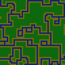

  

    <h1 class="display-4">DeBroglie</h1>
    
Generate tile based maps using Wave Function Collapse

    <small class="text-muted"><a class="github-link" href="TODO">View in Github</a><small>
    

    
It uses utility classes for typography and spacing to space content out within the larger container.

    

      <a class="btn btn-primary btl-lg" href="articles/" role="button">Getting Started</a>
      <a class="btn btn-primary btl-lg" href="TODO" role="button">Download Latest</a>
    

  

  

    

      <section>
        <h2>C# Library and Command line Program</h2>
        
Control generation directly in C# within Unity or .NET Core.

        
Generate maps from JSON configuration files using the executable (Windows only)
 
      </section>
    

  

  
  

    

      <section>
        <h2>Features</h2>
        <h3>Generate tile maps using the WCF algorithm</h3>
        <video src="images/rotation.webm" autoplay loop></video>
        <h3><a href="articles/features.md#topology">2d, 3d and hexagonal generation</a></h3>
        
        
        <h3>Constrain generation to only connected paths</h3>
        
        <h3>Backtracking support for tough-to-generate setups</h3>
      </section>
    

  

